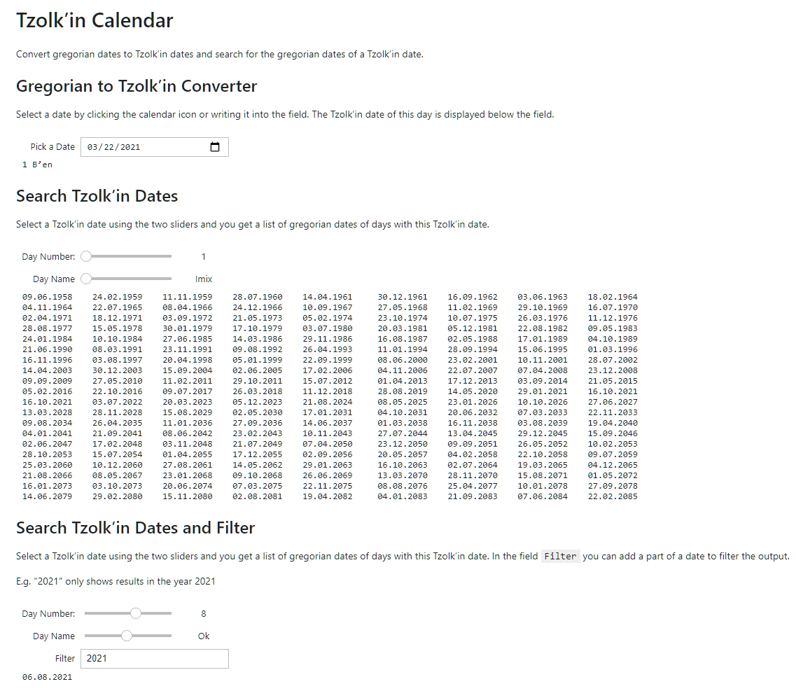

# tzolkin-calendar - Converter for Maya Tzolk’in Dates

This program converts mayan Tzolk’in dates to gregorian dates and vice versa.
If you want to know more about the maya calendar systems, see [Links](#links).

Information about the installation and usage you find at [Installation and Usage](#installation-and-usage)

[](https://github.com/Release-Candidate/tzolkin-calendar/blob/main/LICENSE)
[](https://www.python.org/downloads/)
[](https://pypi.org/project/tzolkin-calendar/)
[](https://tzolkin-calendar.readthedocs.io/en/latest/?badge=latest)
[](https://github.com/psf/black)
[more badges](#badges)

## Table of Contents <!-- omit in toc -->

- [tzolkin-calendar - Converter for Maya Tzolk’in Dates](#tzolkin-calendar---converter-for-maya-tzolkin-dates)
  - [Links](#links)
  - [Installation and Usage](#installation-and-usage)
    - [Prerequisites](#prerequisites)
    - [Installation](#installation)
    - [Usage](#usage)
      - [Using the Command-Line Client](#using-the-command-line-client)
      - [Using the Jupyter Notebook](#using-the-jupyter-notebook)
      - [Using the Python Module in Your Programs](#using-the-python-module-in-your-programs)
    - [More information](#more-information)
  - [Contributing](#contributing)
    - [Report Issues (Bugs and Feature Requests)](#report-issues-bugs-and-feature-requests)
    - [Changing the Documentation and Source Code](#changing-the-documentation-and-source-code)
    - [Github Documentation on Collaborating with Issues and Pull Requests](#github-documentation-on-collaborating-with-issues-and-pull-requests)
  - [License](#license)
  - [Badges](#badges)
    - [External Checks](#external-checks)
    - [Static Code Checks](#static-code-checks)
    - [Tests](#tests)

## Links

Smithsonian Museo Nacional del Indígena Americano: [Viviendo El Tiempo Maya](https://maya.nmai.si.edu/es)

Website of the Smithsonian National Museum of the American Indian on Mayas [Living Maya Time](https://maya.nmai.si.edu/).

Online general Maya (not only Tzolk’in) calendar converter: [Maya Converter of the Smithsonian NMAI](https://maya.nmai.si.edu/calendar/maya-calendar-converter)

[Convertidor Al Calendario Maya Smithsonian NMIA](https://maya.nmai.si.edu/es/calendario/convertidor-de-calendario-maya)

Mayan Glyphs and Unicode: [Roadmap to the SMP](https://www.unicode.org/roadmaps/smp/) and the PDF [Updated List of Characters for Mayan Codices](https://www.unicode.org/L2/L2020/20248-mayan-update.pdf)

## Installation and Usage

### Prerequisites

You need Python, at least version 3.9 to be able to use tzolkin-calendar. You can
download it from [python.org](https://www.python.org/downloads/).

To install the package, you need pip, see [Installing pip](https://pip.pypa.io/en/stable/installing/).

### Installation

Install the package using pip on a shell or command prompt:

```shell
python -m pip install tzolkin-calendar
```

More information about using pip you get at [pip Quickstart](https://pip.pypa.io/en/stable/quickstart/)

### Usage


#### Using the Command-Line Client

#### Using the Jupyter Notebook

You can get Information about Jupyter Notebooks at the [official site](https://jupyter-notebook.readthedocs.io/en/stable/)

Install Jupyter Notebook, Viola and ipywidgets

```shell
python -m pip install notebook voila ipywidgets
```

If you want to be able to open the Jupyter notebook files directly, install `nbopen`.

```shell
python -m pip install nbopen
```

and add the extension to the list of extensions of your OS, so that you can double click
the `.ipynb` files and Jupyter opens it.

On Linux:

```shell
python -m nbopen.install_xdg
```

On Windows:

```shell
python -m nbopen.install_win
```

For OS X, the installation is a bit more advanced, see [nbopen](https://github.com/takluyver/nbopen)

Download the Tzolk’in calendar notebook at [Tzolk’in Calendar.ipynb](https://raw.githubusercontent.com/Release-Candidate/tzolkin-calendar/main/Tzolk%E2%80%99in%20Calendar.ipynb)

Open it in Jupyter Notebook and click the `Voila` button.


You should now see something like:



#### Using the Python Module in Your Programs

ASA

### More information

Detailed information is available at the [documentation website](https://tzolkin-calendar.readthedocs.io/en/latest/).

## Contributing

Any help is welcome!

If you encounter a problem using tzolkin-calendar, a task it not as easy as you'd like it to be
or you'd like something added to it: open an issue at GitHub.

### Report Issues (Bugs and Feature Requests)

File a bug report at [Github](https://github.com/Release-Candidate/tzolkin-calendar/issues/new?assignees=&labels=&template=bug_report.md&title=)

Add a feature request at [Github](https://github.com/Release-Candidate/tzolkin-calendar/issues/new?assignees=&labels=&template=feature_request.md&title=)

### Changing the Documentation and Source Code

If you'd like to contribute directly, e.g. better the documentation, add another language or
write some source code: fork tzolkin-calendar by clicking the `Fork`-button in the upper right
corner of the [GitHub project website](https://github.com/Release-Candidate/tzolkin-calendar).
Check out your fork of tzolkin-calendar using the URL from the `Code`-button of your fork on Github.
The URL should be something like *github.com/YOUR_USERNAME/tzolkin-calendar.git*.

Details about how to fork a repository on Github are [here](https://docs.github.com/en/github/collaborating-with-issues-and-pull-requests/working-with-forks)

and set up the development environment using pipenv.

First, install pipenv if you don't already have it installed:

```shell
python -m pip install --upgrade pipenv
```

and install all needed packages to develop tzolkin-calender:

```shell
cd tzolkin-calendar
python -m pipenv install --dev
```

That command installs all packages in `Pipfile`/`Pipfile.lock` in the directory `tzolkin-calender`,
the root directory of tzolkin-calendar.

More information about pipenv can be found at [Pipenv](https://pipenv.pypa.io/en/latest/).

Make your changes, push them to your forked repository and make a pull-request (e.g.
using the `Pull request`-button above and right of GitHubs source file view).

See [GitHub on Pull-Requests](https://docs.github.com/en/github/collaborating-with-issues-and-pull-requests/proposing-changes-to-your-work-with-pull-requests)

### Github Documentation on Collaborating with Issues and Pull Requests

See GitHub's documentation about how to contribute for details: [Contributing at Github](https://docs.github.com/en/github/collaborating-with-issues-and-pull-requests)

## License

Everything in `tzolkin-calendar` is licensed under the MIT license, see file [LICENSE](./LICENSE)

## Badges

### External Checks

[](https://deepsource.io/gh/Release-Candidate/tzolkin-calendar/?ref=repository-badge)
[](https://codeclimate.com/github/Release-Candidate/tzolkin-calendar/maintainability)
[](https://codecov.io/gh/Release-Candidate/tzolkin-calendar)

### Static Code Checks

[](https://github.com/Release-Candidate/tzolkin-calendar/actions/workflows/bandit.yml)
[](https://github.com/Release-Candidate/tzolkin-calendar/actions/workflows/black.yml)
[](https://github.com/Release-Candidate/tzolkin-calendar/actions/workflows/flake8.yml)
[](https://github.com/Release-Candidate/tzolkin-calendar/actions/workflows/pycodestyle.yml)
[](https://github.com/Release-Candidate/tzolkin-calendar/actions/workflows/pydocstyle.yml)
[](https://github.com/Release-Candidate/tzolkin-calendar/actions/workflows/pyflakes.yml)

### Tests

[](https://github.com/Release-Candidate/tzolkin-calendar/actions/workflows/osx.yml)
[](https://github.com/Release-Candidate/tzolkin-calendar/actions/workflows/osx_test.yml)
[](https://github.com/Release-Candidate/tzolkin-calendar/actions/workflows/linux.yml)
[](https://github.com/Release-Candidate/tzolkin-calendar/actions/workflows/linux_test.yml)
[](https://github.com/Release-Candidate/tzolkin-calendar/actions/workflows/windows.yml)
[](https://github.com/Release-Candidate/tzolkin-calendar/actions/workflows/windows_test.yml)
