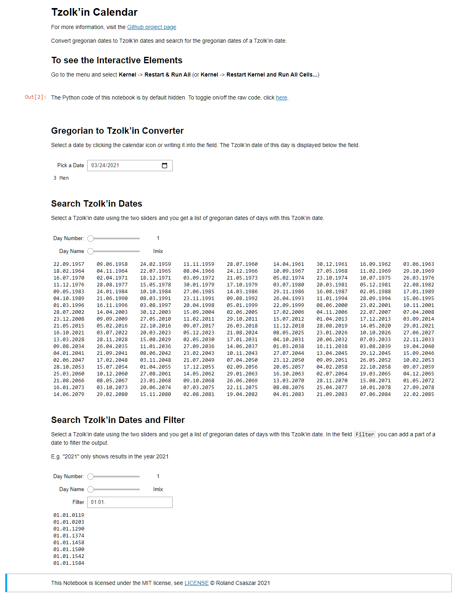

Interactive Jupyter Notebook
============================

You can test it online at `Interactive Jupyter Notebook online at MyBinder <https://mybinder.org/v2/gh/Release-Candidate/tzolkin-calendar/main?filepath=Tzolk%E2%80%99in%20Calendar.ipynb>`_.
You need to restart the kernel first by going to the menu and selecting
**Kernel**->**Restart & Run All** to get the interactive sliders and input fields.

More Information about Jupyter Notebooks at the `official documentation <https://jupyter-notebook.readthedocs.io/en/stable/>`_

Installation
------------

Install Jupyter Notebook and ipywidgets

.. code-block:: shell

    python -m pip install notebook ipywidgets

If you want to be able to open the Jupyter notebook files directly, install ``nbopen``.

.. code-block:: shell

    python -m pip install nbopen

and add the extension to the list of extensions of your OS, so that you can double click
the ``.ipynb`` files and Jupyter opens it.

On Linux:

.. code-block:: shell

    python -m nbopen.install_xdg

On Windows:

.. code-block:: shell

    python -m nbopen.install_win

For OS X, the installation is a bit more advanced, see `nbopen <https://github.com/takluyver/nbopen>`_.

Download the Tzolk’in calendar notebook from GitHub, using ``Save As`` with this link: `Tzolk’in Calendar.ipynb <https://raw.githubusercontent.com/Release-Candidate/tzolkin-calendar/main/Tzolk%E2%80%99in%20Calendar.ipynb>`_.

Open it in Jupyter Notebook and run all cells, by going to the menu and using **Kernel** -> **Restart** **&** **Run** **All**.

You should now see something like:

